- [What is a horizon plot?](#what-is-a-horizon-plot)
- [Loading in the package](#loading-in-the-package)
- [Preview of Diet Sample Data](#preview-of-diet-sample-data)
- [Data Refining and OTU Selection](#data-refining-and-otu-selection)
- [Constructing the Horizon Plot](#constructing-the-horizon-plot)
- [Plot a Single Microbe Across Multiple Subjects](#plot-a-single-microbe-across-multiple-subjects)
- [Adjust bands to highlight common or rare OTUs](#adjust-bands-to-highlight-common-or-rare-otus)
- [Dealing with Missing and/or Irregularly Spaced Data](#dealing-with-missing-andor-irregularly-spaced-data)
- [Customizing Plot Aesthetics](#customizing-plot-aesthetics)
- [Reproducing Plots from the Manuscript](#reproducing-plots-from-the-manuscript)

BiomeHorizon is an R package for visualizing longitudinal microbiome data in the form of a horizon plot. A horizon plot provides a compact way to visualize multiple time series in parallel by overlying the values at different ranges of magnitude. Though this package is designed for microbiome data, it can be used to visualize other types of longitudinal data as well.  

In this tutorial, we will create a basic horizon plot from sample data, and then add modifications to demonstrate the versatility of the package. We provide two sample data sets; one is a human dietary supplement study ([Johnson et al. 2019](https://doi.org/10.1016/j.chom.2019.05.005); data downloaded from https://github.com/knights-lab/dietstudy_analyses/tree/master/data/maps). The diet data set includes fecal shotgun metagenomes from 34 human subjects collected daily over 17 days. The second study uses opportunistically collected fecal amplicons (16S) from a wild baboon population (Grieneisen et al. accepted; data downloaded from doi:10.5281/zenodo.4662081). The baboon data set includes a subset of 276 samples from 6 baboon subjects (27 - 69 samples per subject) collected over 2-11 years per subject. Each data set contains an OTU (baboon) or microbial taxon ID (diet) table, a corresponding table of microbial taxonomy information, and a metadata table with collection dates.


### What is a horizon plot?

A horizon plot is an effective method of visualizing change in values over time, in a fraction of the vertical space used by a line or area graph. The figure below illustrates step-by-step how a horizon plot is constructed from an area graph.


1. Values are plotted as a relative abundance vs. time area graph for each OTU time series.
2. Values are centered to a 'zero', in this case the median relative abundance. This centered value is referred to as the 'horizon' or 'origin'.
3. The plotting area is divided into quartile 'bands' above and below the origin, with darker blue bands indicating values incrementally above the origin and darker red bands below the origin; negative bands are mirrored upward.
4. Bands are overlaid to compress vertical space.

This increased data density enables easier comparison between time series, as we will see below.


The graphs above depict the same diet sample data provided earlier. Note that the usage of a unique scale for each subplot captures the proportional decrease in abundance of *taxon 36* and *taxon 38* around timepoint 2 which follows the trend of other microbes, but is dwarfed by more highly abundant microbes in the line graph.

In the rest of the tutorial, we will learn how to use the package to make a horizon plot.

### Loading in the package

The sample data sets and dependencies are loaded automatically with the package.

```r
## Install devtools
install.packages("devtools")

devtools::install_github("blekhmanlab/biomehorizon")
library(biomehorizon)  
```  


### Preview of Diet Sample Data

```r
## OTU table format. The first column contains microbial taxon IDs (or OTUs for 16S data), and
## all other columns are samples. Values represent sample reads per microbe within a given sample.
## Though in this case values are integer sample reads, they can also be represented as
## proportions or percentages of the total sample. Columns do not need defined names.
library(dplyr)

otusample_diet %>%
	arrange(desc(MCT.f.0002)) %>%
	select(1:7) %>%
	head()
```

```r
  taxon_id  MCT.f.0002  MCT.f.0003  MCT.f.0004  MCT.f.0005  MCT.f.0006  MCT.f.0007
1	taxon 1	  220949	    25921	      112186	    48113	      52260	      78360
2	taxon 2	  63019	      4537	      31306	      16093	      14077	      24294
3	taxon 4	  51407	      436	        20574	      10770	      11810	      22105
4	taxon 6	  50088	      5124	      25748	      12910	      11716	      12623
5	taxon 30  42797	      2867	      21296	      12927	      9489	      16386
6	taxon 3	  37879	      2868	      16377	      7226	      7554	      12240

```

```r
## Metadata format. Must include sample IDs that match the column names of otusample,
## subject IDs, and collection dates in either date or numeric format. 
## The columns with sample IDs, collection dates and subject names must be named 
## "sample", "collection_date" and "subject" respectively. 
head(metadatasample_diet)
```

```r
   subject      sample collection_date supplement
1	 MCTs01	 MCT.f.0002	              2	      EVOO
2	 MCTs01	 MCT.f.0003	              3	      EVOO
3	 MCTs01	 MCT.f.0004	              4	      EVOO
4	 MCTs01	 MCT.f.0005	              5	      EVOO
5	 MCTs01	 MCT.f.0006	              6	      EVOO
6	 MCTs01	 MCT.f.0007	              7	      EVOO
```

```r
## Taxonomydata format. Describes taxonomy of each microbe (or OTU, for 16S data) from Kingdom
## through Genus.
## Levels without classification have NA values.
## You can supply a vector of strings each with the entire taxonomy of a microbe,
## with levels separated by semicolons, or a table with columns for each taxonomic level where the first
## column is the OTU ID. Columns do not need defined names.
## Supports classification up to Subspecies (8 levels)
head(taxonomysample_diet)
```

```r
  taxon_id                                                                                                                     taxonomy
1  taxon 1                                                  Bacteria;Bacteroidetes;Bacteroidia;Bacteroidales;Bacteroidaceae;Bacteroides
2  taxon 2                            Bacteria;Bacteroidetes;Bacteroidia;Bacteroidales;Bacteroidaceae;Bacteroides;Bacteroides uniformis
3  taxon 3                                                                             Bacteria;Bacteroidetes;Bacteroidia;Bacteroidales
4  taxon 4 Bacteria;Bacteroidetes;Bacteroidia;Bacteroidales;Rikenellaceae;Alistipes;Alistipes putredinis;Alistipes putredinis DSM 17216
5  taxon 5       Bacteria;Bacteroidetes;Bacteroidia;Bacteroidales;Prevotellaceae;Prevotella;Prevotella copri;Prevotella copri DSM 18205
6  taxon 6                                Bacteria;Bacteroidetes;Bacteroidia;Bacteroidales;Bacteroidaceae;Bacteroides;Bacteroides dorei
```  


### Data Refining and OTU Selection

Before we visualize the data using the main function, we must first prepare the data sets and other variables for analysis using the `prepanel` function. This will do several things, most importantly:

1. Filter OTUs
2. Filter samples to just one subject
3. Convert values to percentages, if they are not already in that format
4. Check format of data sets
5. Check for and catch common user errors

Then, it will output the refined arguments in a list that can be supplied to the main function.

You can use this function with just an OTU table, but this will assume that all samples come from the same subject. Since *otusample_diet* has 34 subjects, we will need to provide additional metadata matching samples to their subjects. Our metadata also contains collection time points for each sample, which will allow us to ensure samples are ordered chronologically.

Let's select the subject "MCTs01". How many samples are from MCTs01?

```r
length(metadatasample_diet$subject[metadatasample_diet$subject == "MCTs01"])

paramList <- prepanel(otudata = otusample_diet, metadata = metadatasample_diet, subj = "MCTs01")
```

```r
[1] 15

Constructed an OTU table and other variables with the following settings:
thresh_prevalence: 80
thresh_abundance: 0.5
thresh_NA: 5
subj: MCTs01

35 OTUs met the filtering requirements, with the following stats:
     OTU_ID Average_abundance Prevalence Num_missing_samples
1   taxon 1        23.4808510        100                   0
2   taxon 2         7.0220155        100                   0
3   taxon 3         3.6456202        100                   0
4   taxon 4         5.6399479        100                   0
5   taxon 6         3.4120092        100                   0
6   taxon 8         1.7292719        100                   0
7   taxon 9         2.9895162        100                   0
8  taxon 10         1.9505486        100                   0
9  taxon 11         1.3130744        100                   0
10 taxon 12         0.8252183        100                   0
11 taxon 13         2.8683227        100                   0
12 taxon 14         4.4062186        100                   0
13 taxon 15         1.3139743        100                   0
14 taxon 17         0.8876090        100                   0
15 taxon 20         1.4390210        100                   0
16 taxon 21         1.0271952        100                   0
17 taxon 23         1.6986533        100                   0
18 taxon 29         1.0616267        100                   0
19 taxon 30         4.7897075        100                   0
20 taxon 31         1.1059012        100                   0
21 taxon 36         1.0114477        100                   0
22 taxon 38         0.6557752        100                   0
23 taxon 39         0.8448858        100                   0
24 taxon 44         0.7525526        100                   0
25 taxon 45         0.6716049        100                   0
26 taxon 49         0.8346752        100                   0
27 taxon 51         0.6398042        100                   0
28 taxon 53         0.5779908        100                   0
29 taxon 59         1.9856799        100                   0
30 taxon 60         0.5668495        100                   0
31 taxon 63         3.0629905        100                   0
32 taxon 67         0.9129272        100                   0
33 taxon 71         0.5442007        100                   0
34 taxon 82         0.5669060        100                   0
35 taxon 85         0.5926795        100                   0
`biomehorizonpkg_otu_stats` was outputted to the environment.
```
Great. Now you should see in the console, the function selected several OTUs considered the most "important". By default, this is done using four filtering standards.

- **thresh_prevalence**: How many samples in this OTU contain at least one sample read that maps to this OTU?
- **thresh_abundance**: Out of the samples that contain reads for this OTU, what was the average abundance of this OTU? i.e., what percentage of total reads in the sample are from this OTU?
- **thresh_abundance_override**: The same measurement as *thresh_abundance*, but if this higher threshold is reached, it overrides all other standards and the OTU is included.
- **thresh_NA**: This sets the maximum allowed percentage of samples with missing data (NA) for this OTU.

As an example, *taxon 2* appears in 15/15 samples, giving it a "prevalence score" of 100%. Out of the 15 samples with at least one read, the average proportion of total reads is 0.0702, giving it an "abundance score" of 7.02%. This meets the default standards of 80% prevalence and 0.5% abundance, so the microbe is included.

We can view the sample reads that were aggregated to produce these prevalence and abundance scores for *taxon 2* below. Note that since there are no zero values, prevalence is 100%, and thus abundance is equal to the mean of all values.

```r
library(dplyr)
## Retrieve samples from MCTs01
otusample_subj1 <- otusample_diet %>%
	select(taxon_id, as.character((metadatasample_diet %>% filter(subject=="MCTs01"))$sample))

## Samples reads for taxon 2
otusample_subj1 %>%
	filter(taxon_id == "taxon 2") %>%
	select(-taxon_id) %>%
	as.numeric()
```

```r
[1] 63019  4537 31306 16093 14077 24294 31317 35236 18594 52592 16422 39671 13605 32534  3230
```

These 35 OTUs were selected using the default filtering thresholds, but maybe we want stricter standards.

```r
paramList <- prepanel(otudata = otusample_diet, metadata = metadatasample_diet, subj = "MCTs01",
thresh_prevalence = 90, thresh_abundance = 1.5)
```

```r
Constructed an OTU table and other variables with the following settings:
thresh_prevalence: 90
thresh_abundance: 1.5
thresh_NA: 5
subj: MCTs01

14 OTUs met the filtering requirements, with the following stats:
     OTU_ID Average_abundance Prevalence Num_missing_samples
1   taxon 1         23.480851        100                   0
2   taxon 2          7.022015        100                   0
3   taxon 3          3.645620        100                   0
4   taxon 4          5.639948        100                   0
5   taxon 6          3.412009        100                   0
6   taxon 8          1.729272        100                   0
7   taxon 9          2.989516        100                   0
8  taxon 10          1.950549        100                   0
9  taxon 13          2.868323        100                   0
10 taxon 14          4.406219        100                   0
11 taxon 23          1.698653        100                   0
12 taxon 30          4.789708        100                   0
13 taxon 59          1.985680        100                   0
14 taxon 63          3.062990        100                   0
`biomehorizonpkg_otu_stats` was outputted to the environment.
```

Alternatively, we can manually select OTUs.

```r
paramList <- prepanel(otudata = otusample_diet, metadata = metadatasample_diet, subj = "MCTs01",
otulist = c("taxon 1", "taxon 2", "taxon 10", "taxon 14"))
```  


### Constructing the Horizon Plot

After refining the data with `prepanel`, we supply the parameter list to `horizonplot` to construct the horizon plot.

```r
## Basic plot using default filtering thresholds
paramList <- prepanel(otudata = otusample_diet, metadata = metadatasample_diet, subj = "MCTs01")

horizonplot(paramList)

## Select microbes manually
paramList <- prepanel(otudata = otusample_diet, metadata = metadatasample_diet, subj = "MCTs01",
otulist = c("taxon 1", "taxon 2", "taxon 10", "taxon 14"))

horizonplot(paramList)
```

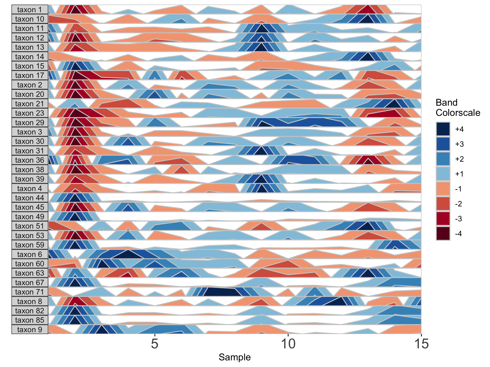

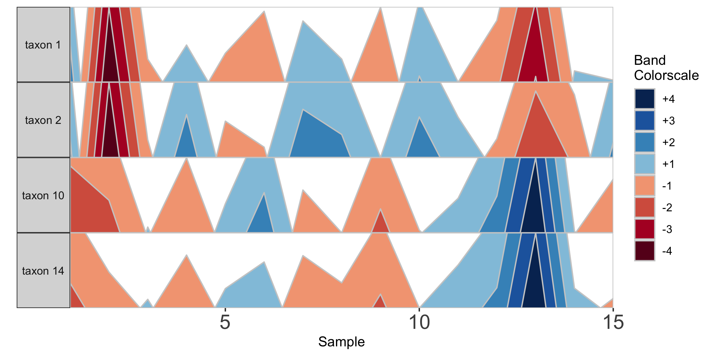

Note that in the plot with manual selection, microbes are arranged according to their order in otulist. If you want to arrange microbe panels in a specific order, you should use this vector.

> **NOTE**: If you are experiencing issues running the `horizonplot()` command with your own datasets, make sure you are importing your data correctly. Ideally, you should import data as a csv using the `read.csv` command (e.g., `otudata <- read.csv('</path/to/otutable>/<filename>.csv')`).


### Plot a Single Microbe Across Multiple Subjects

Rather than plotting multiple microbes in one subject, we can also plot one microbe to compare the same timepoint across multiple subjects. To use this setting, however, subjects must have the same number of samples collected on the same days. We will subset the diet data set to 6 subjects who were sampled all 17 days of the study.

```r
## Subset the data set to the subjects who were sampled on all 17 days, and arrange by date
metadata_17 <- metadatasample_diet %>%
  filter(subject %in% c("MCTs08","MCTs18","MCTs23","MCTs26","MCTs33","MCTs36")) %>%
  arrange(subject, collection_date)

otu_17 <- otusample_diet %>%
  select(taxon_id, as.character((metadatasample_diet %>% filter(subject %in% 
  c("MCTs08","MCTs18","MCTs23","MCTs26","MCTs33","MCTs36")))$sample))

## Single variable analysis with "Taxon 1"
paramList <- prepanel(otudata = otu_17, metadata = metadata_17, singleVarOTU = "taxon 1", subj = 		
	c("MCTs08","MCTs18","MCTs23","MCTs26","MCTs36","MCTs33"))

horizonplot(paramList)
```

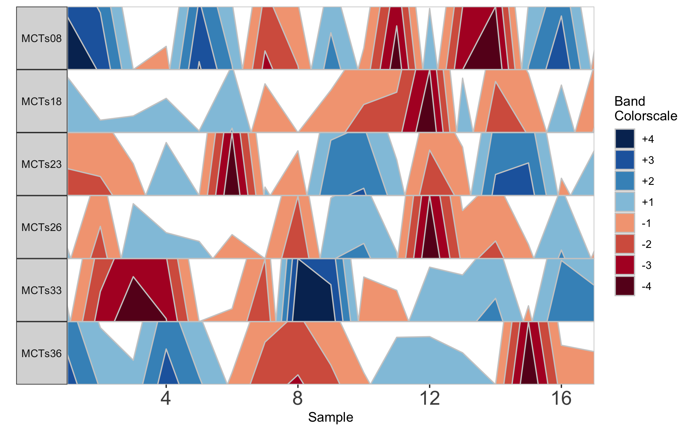

Based on this graph we might then infer that subjects MCTs18, MCTs23, and MCTs26 all have a decreased abundance of *Taxon 1* at sampling timepoint 12. Notice that subject facets are arranged according to their order in the vector supplied to *subj*.


### Adjust bands to highlight common or rare OTUs

To emphasize different properties of the data, the bands on a horizon plot can be adjusted. There are three metrics which define the range of values on the horizon plot: **origin**, **band thickness**, and **nbands**.

#### Default values

The base of the first positive band for an OTU, where the Y-axis value=0, is the **origin**. The Y-scale height of each band is the **band thickness**. By default, the origin for each OTU is calculated as the median value of that OTU across all samples, and band widths represent 4 quartiles above (blue bands) and 4 quartiles below (red bands) the origin relative to the absolute extreme value for that OTU.

In other words, if OTU A has relative abundance values ranging from **0% to 30%** with a median of **10%**, then each band represents an abundance range of **(30-10)/4 = 5%**. Thus, a band colorscale value of **+2** for OTU A at timepoint 1 indicates that OTU A had a relative abundance between **(min = 10 + 5, max = 10 + 2*5) = 15-20%** at timepoint 1, while a band colorscale value of **-2** for OTU A at timepoint 2 indicates that OTU A had a relative abundance ranging from **0-5%** at timepoint 2. Because the distance between the maximum and the origin **(30-10% = 20%)** is greater than the distance between the minimum and the origin **(10-0% = 10%)** for OTU A, there are no timepoints with a band colorscale of **-3** or **-4**.

By scaling within each OTU, the dynamics of multiple OTUs that may vary in median abundance by orders of magnitude can be visualized on the same graph.

However, we can add several modifications to the horizon plot to emphasize different aspects of our longitudinal data.  

#### Custom values

First, we change the number of positive bands into which data is segmented.

```r
paramList <- prepanel(otudata = otusample_diet, metadata = metadatasample_diet, subj = "MCTs01", nbands = 3)

horizonplot(paramList)
```


Including more horizon bands will more precisely distinguish values and emphasize those at the highest ranges of magnitude. Using fewer bands will de-emphasize values at the extreme ends of the data.

We can also change the origin, the value at which all sample values will be centered. We can supply this either as a constant, to set a fixed origin value for all OTUs, or as a function that operates on sample values, to evaluate a unique origin for each panel.

```r
## Origin as the mean absolute deviation of sample values
paramList <- prepanel(otudata = otusample_diet, metadata = metadatasample_diet, subj = "MCTs01", origin = function(y) { mad(y, na.rm = TRUE) })

horizonplot(paramList)
```

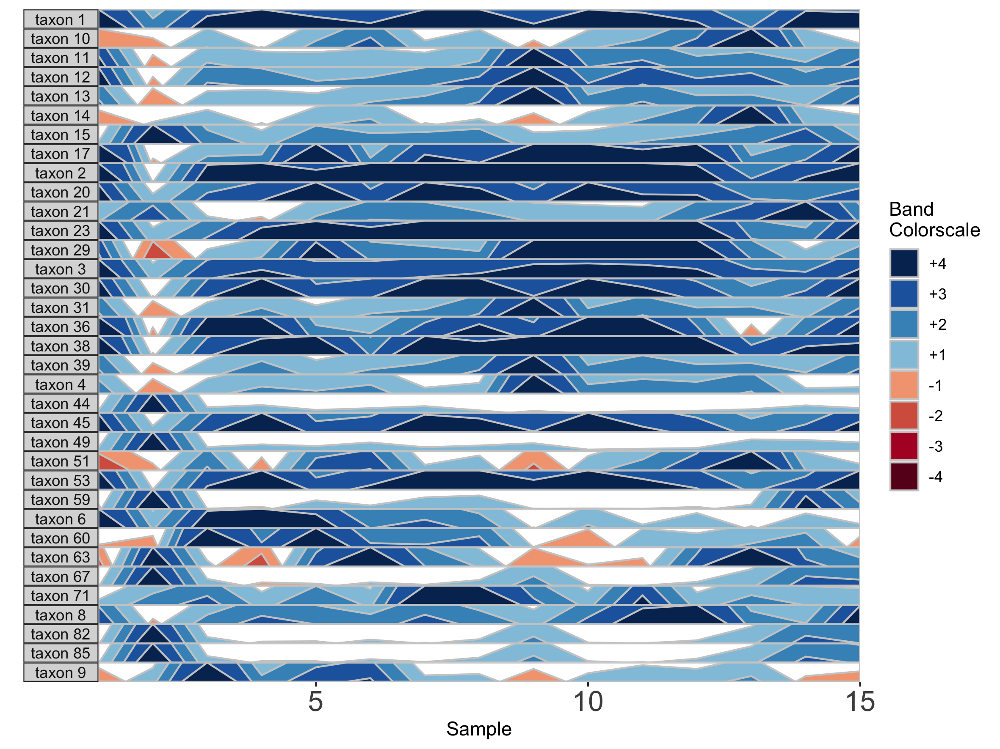

```r
## Set a fixed origin of 1% for all OTU subpanels
paramList <- prepanel(otudata = otusample_diet, metadata = metadatasample_diet, subj = "MCTs01", origin = 1)
horizonplot(paramList)
```


Similarly, we can modify the **band thickness**, the height of each horizontal band denoted by a unique color, which determines the scale of a horizon subplot.

```r
## Set band thickness to 1/6 the distance between the origin and maximum value
paramList <- prepanel(otudata = otusample_diet, metadata = metadatasample_diet, subj = "MCTs01", band.thickness = function(y) {max((abs(y - origin(y))), na.rm=TRUE) / 6})

horizonplot(paramList)
```

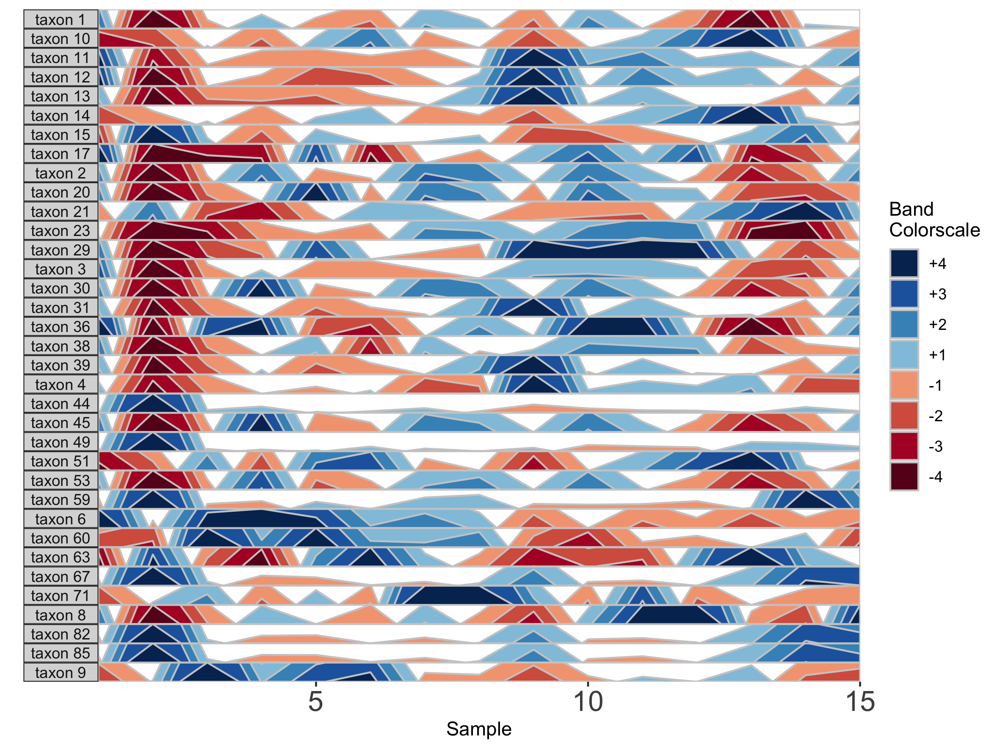

Here, because the top of the highest band is only 4/6 of the maximum value, this becomes the new maximum and all higher values are rounded down. The same is true for negative bands. This can be valuable for de-emphasizing outliers at the extrema of the data.

```r
## Fixed band thickness of 10%
paramList <- prepanel(otudata = otusample_diet, metadata = metadatasample_diet, subj = "MCTs01", band.thickness = 10)

horizonplot(paramList)
```

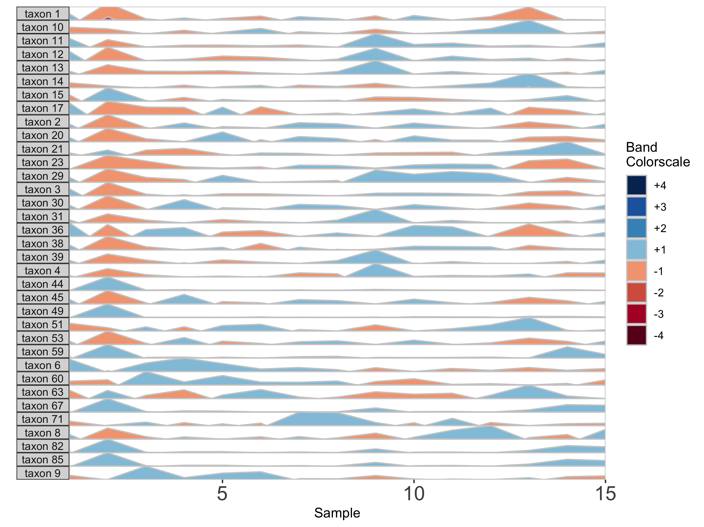

```r
## Fixed band thickness of 2%
paramList <- prepanel(otudata = otusample_diet, metadata = metadatasample_diet, subj = "MCTs01", band.thickness = 2)

horizonplot(paramList)
```


```r
## Fixed band thickness of 0.2%
paramList <- prepanel(otudata = otusample_diet, metadata = metadatasample_diet, subj = "MCTs01", band.thickness = 0.2)

horizonplot(paramList)
```


Notice that at smaller values of `band.thickness`, an increasing number of values are above the new maximum or below the new minimum, resulting in more extreme bands (at +4 or -4). This accentuates changes in microbes with low abundances but compresses change in microbes with larger abundances, making small increases ambiguous from large increases.

```r
## Fixed origin AND fixed band thickness
paramList <- prepanel(otudata = otusample_diet, metadata = metadatasample_diet, subj = "MCTs01", origin = 1, band.thickness = 1)
horizonplot(paramList)
```


Setting a fixed origin *and* band thickness lets us compare values between facets. For example, in nearly all samples, *taxon 2* is more abundant than *taxon 17*. We can't say this about a plot with a variable origin, as values are not centered to the same zero. Similarly, a variable band thickness means the distance of a positive value from the origin is not consistent between subplots.  


### Dealing with Missing and/or Irregularly Spaced Data

Missing data points are common in microbiome data sets. To deal with the occasional missing data point, the package offers tools to transform the data into a regularly spaced time series. To do this, we specify an interval of time at which to interpolate new data. Because the diet study was conducted daily over 17 days, we specify an interval of 1 day. As an example, we use subject MCTs16, who was sampled on 14 / 17 days.

```r
## Adjust data to a regular time interval of 1 day
paramList <- prepanel(otudata = otusample_diet, metadata = metadatasample_diet, subj = "MCTs16", regularInterval = 1)
```

We can see the sample collection days starting from day 1 by viewing the `timestamps` variable from the output list of prepanel. This is the third element of the list (you can view components of the list in the horizonplot function documentation).

```r
paramList[[3]]
```

```r
  [1]  1  3  4  5  6  8  9 10 11 12 14 15 16 17
```

Each new value will be linear interpolated from the previous and subsequent timepoints. We can then plot the interpolated points with the observed data points.

```r
horizonplot(paramList)
```


Note that because data have been interpolated to regular intervals, the x-axis label has changed to 'Day' rather than 'Sample'.

Interpolation may not be appropriate for data sets with large gaps between collection days. For irregularly spaced microbiome data, such as those collected as part of observational sampling in wild animal microbiome studies or collected during certain times of the year over multiple years (e.g. summer field seasons), regularizing can introduce inaccuracy by interpolating across large timespans. Further, plotting data without accounting for temporal differences in sampling can potentially create misleading plots. For example, subject Baboon_388 had 59 samples collected over 3 1/2 years (1316 days).

```r
## Plot samples from subject Baboon_388
paramList <- prepanel(otudata = otusample_baboon, metadata = metadatasample_baboon, subj = "Baboon_388")

horizonplot(paramList)
```


Because *otusample_baboon* is irregularly spaced, i.e. the distance of time between samples is not consistent throughout the time series, the timescale on the plot is misleading, even if we regularize the data by interpolating between points. We can reduce this inaccuracy by specifying the maximum amount of time without samples allowed (i.e. a gap) to create an interpolated timepoint. For example, if we interpolate a point every 50 days, but set the maximum gap between samples at 100 days, two samples that are >100 days apart will not have an interpolated timepoint. Instead, it will produce a break in the time axis, and data will be regularized separately on both sides of the break. This break is simulated by splitting the plot into two facets.

```r
## Set maxGap to 75
paramList <- prepanel(otudata = otusample_baboon, metadata = metadatasample_baboon, subj = "Baboon_388", regularInterval = 25, maxGap = 75)

# Append custom set of axis ticks to avoid overlapping labels
horizonplot(paramList) +
	ggplot2::scale_x_continuous(expand = c(0,0),
	breaks = seq(from = 0, by = 200, to = 1200))
```

We can see the sample collection days starting from day 1.

```r
paramList[[3]]
```

```r
 [1]    1  157  162  172  183  313  415  424  427  430  432  436  443  455  477  479  485
[18]  492  508  511  514  519  569  635  655  691  697  760  773  821  847  877  988 1047
[35] 1068 1071 1071 1074 1076 1087 1093 1096 1096 1099 1102 1107 1118 1121 1121 1136 1150
[52] 1157 1178 1202 1214 1219 1235 1274 1316
```

```r
horizonplot(paramList)
```

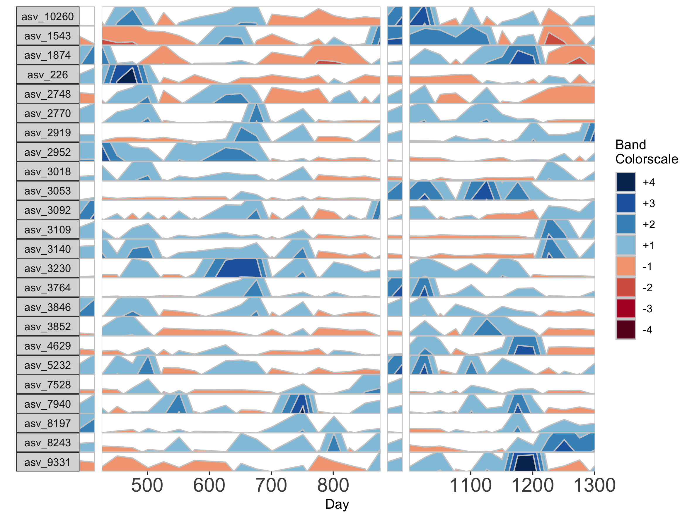

If many breaks in the time axis are created, this could result in facets with very few samples. For example, if maxGap = 150 and the first two samples are at days 1 and 157, the first facet would contain only one sample (day 1). You can set the minimum number of samples required to include a facet. When a breaks result in facets with fewer than the specified minimum, those facets are not shown. The default = 2 samples, so this graph does not start at day 1.

```r
## Remove facets with <5 samples
paramList <- prepanel(otudata = otusample_baboon, metadata = metadatasample_baboon, subj = "Baboon_388", regularInterval = 25, maxGap = 75, minSamplesPerFacet = 5)

horizonplot(paramList) +
	ggplot2::scale_x_continuous(expand = c(0,0),
	breaks = seq(from = 0, by = 100, to = 1300))
```

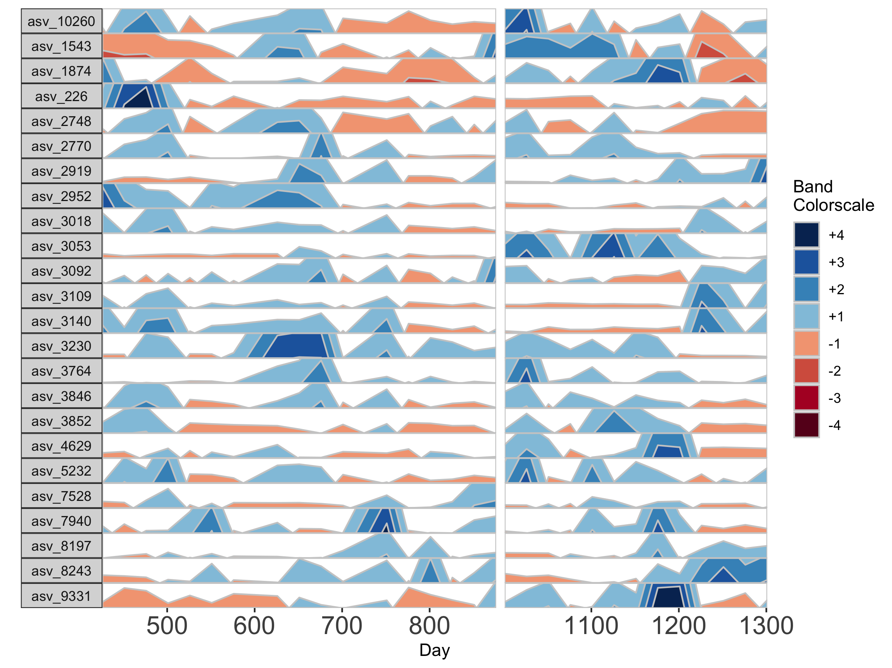


### Customizing Plot Aesthetics

In addition to the default OTU ID labels for each microbe subplot, we can also label facets by their taxonomy. This method will display the most narrow level of classification available for each microbe as a facet label. To do this, we need to supply a third data set with taxonomy information, *taxonomysample*.

```r
## Supply taxonomysample and set facetLabelsByTaxonomy to TRUE
paramList <- prepanel(otudata = otusample_diet, metadata = metadatasample_diet, taxonomydata = taxonomysample_diet$taxonomy, subj = "MCTs01", facetLabelsByTaxonomy = TRUE)

horizonplot(paramList)
```

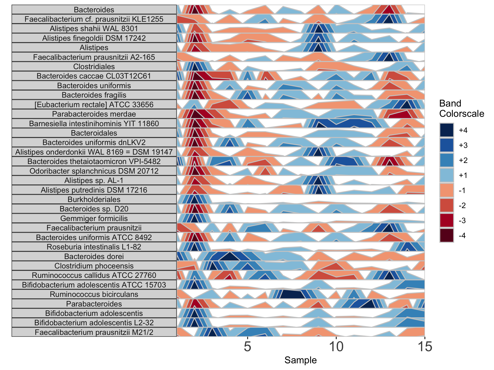

Alternatively, we can supply custom facet labels. These will be applied to facet subplots from top to bottom, in the order they are specified to the vector.

```r
## Apply custom alphabetical facet labels
paramList <- prepanel(otudata = otusample_diet, metadata = metadatasample_diet, taxonomydata = taxonomysample_diet, subj = "MCTs01", otulist = c("taxon 1", "taxon 2", "taxon 10", "taxon 14"), customFacetLabels = LETTERS[1:4])

horizonplot(paramList)
```

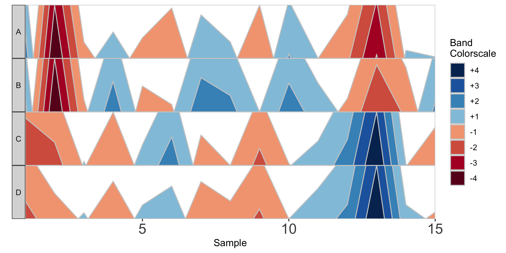  

We can further customize the horizon plot by supplementing a list of aesthetics to the horizonplot() function. We obtain this list by calling the horizonaes() function with the custom aesthetics to override default values. If no custom aesthetics are specified to horizonplot(), default aesthetics will be retrieved by calling horizonaes() with no arguments.

```r
paramList <- prepanel(otudata = otusample_diet, metadata = metadatasample_diet, taxonomydata = taxonomysample_diet, subj = "MCTs01")

## Add a title; override x-label, y-label, and legend title defaults; adjust legend position
horizonplot(paramList, aesthetics = horizonaes(title = "Microbiome Horizon Plot", xlabel = "Samples from Subject MCTs01", ylabel = "Taxa found in >80% of samples", legendTitle = "Quartiles Relative to Taxon Median", legendPosition	= "bottom"))

```


```r
## Remove a default aesthetic
horizonplot(paramList, aesthetics = horizonaes(xlabel = NULL))
```


We can supply a new color scale for horizon bands as a vector of hexadecimal color codes ordered from the most negative to the most positive band. The length of the vector is equal to 2 * the number of positive bands as specified in prepanel.

```r
## How many positive bands?
paramList[[14]]
```

```r
[1] 4
```

```r
## Supply custom color scale of length 8
library(RColorBrewer)
horizonplot(paramList, aesthetics = horizonaes(col.bands = brewer.pal(8, "PiYG")))
```

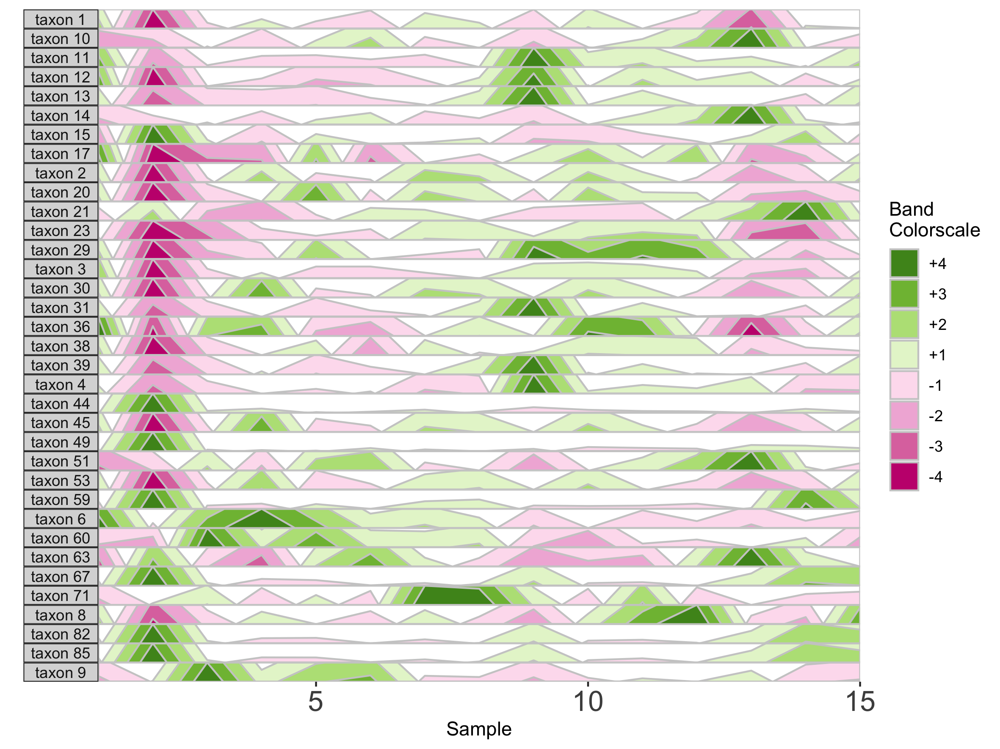

Most commonly relevant aesthetics are returned by horizonaes(), but if we want to add other aesthetics not included in this function, we can manually append them to the horizon plot object using ggplot. For example, we can label the x-axis by date.

```r
## Label the x-axis by date

paramList <- prepanel(otudata = otusample_baboon, metadata = metadatasample_baboon, subj = "Baboon_388", regularInterval = 25, maxGap = 75)

dateVec = as.Date(c(500, 600, 700, 800, 1100, 1200, 1300), origin =min(subset(metadatasample_baboon, subject == "Baboon_388")$collection_date)-1)

horizonplot(paramList, aesthetics = horizonaes(col.bands = brewer.pal(8, "PiYG"))) +
	ggplot2::scale_x_continuous(expand = c(0,0),
	breaks = c(500, 600, 700, 800, 1100, 1200, 1300),
	labels = dateVec) +
  ggplot2::theme(axis.text.x = ggplot2::element_text(angle = 45, hjust = 1))
```

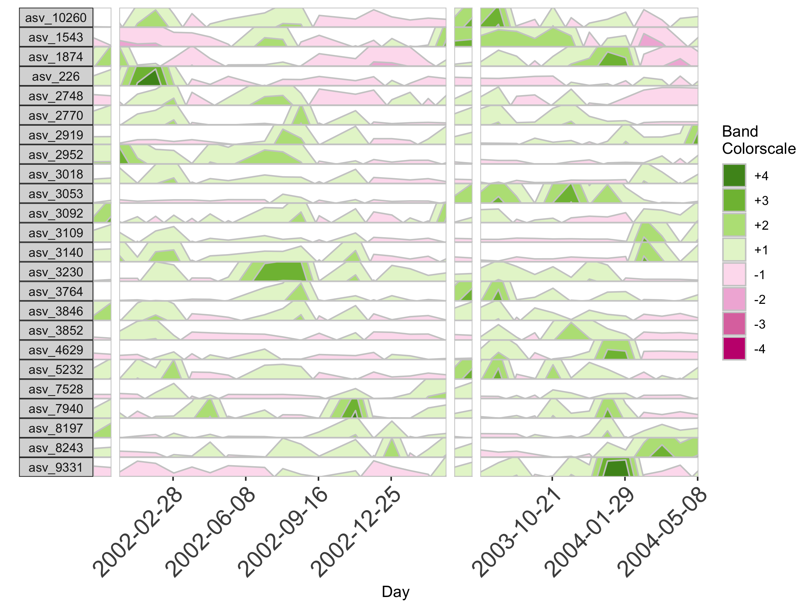


### Reproducing Plots from the Paper

The following code can be used to reproduce all plots shown in the [paper](https://journals.asm.org/doi/10.1128/msystems.01380-21).

```r
library(biomehorizon)
library(dplyr)
library(cowplot)

#### horizonplot component of Fig 1A ####

## Subset the data set to the subjects who were sampled on all 17 days, and arrange by date
metadata_17 <- metadatasample_diet %>%
  filter(subject %in% c("MCTs08","MCTs18","MCTs23","MCTs26","MCTs33","MCTs36")) %>%
  arrange(subject, collection_date)

otu_17 <- otusample_diet %>%
  select(taxon_id, as.character((metadatasample_diet %>% filter(subject %in% c("MCTs08","MCTs18","MCTs23","MCTs26","MCTs33","MCTs36")))$sample))

## Single variable analysis with "Taxon 1"
paramList <- prepanel(otudata = otu_17, metadata = metadata_17, singleVarOTU = "taxon 1")

png("plot_by_subject.png", width = 200, height = 125, units = 'mm', res = 300)

horizonplot(paramList)

dev.off()

#### Fig 1B ####

paramList <- prepanel(otudata = otusample_diet, metadata = metadatasample_diet, taxonomydata = taxonomysample_diet$taxonomy, subj = "MCTs01", facetLabelsByTaxonomy = TRUE, thresh_abundance = 0.75)

png("plot_taxonomy_labels.png", width = 200, height = 150, units = 'mm', res = 300)

horizonplot(paramList)

dev.off()

#### Fig 1C ####

paramList <- prepanel(otudata = otusample_diet, metadata = metadatasample_diet, taxonomydata = taxonomysample_diet$taxonomy, subj = "MCTs01", facetLabelsByTaxonomy = TRUE, origin = 1, band.thickness = 10, thresh_abundance = 0.75)

png("plot_origin1_bandthick10.png", width = 200, height = 150, units = 'mm', res = 300)

horizonplot(paramList)

dev.off()

#### Fig 1D ####

library(RColorBrewer)
paramList <- prepanel(otudata = otusample_baboon, metadata = metadatasample_baboon, subj = "Baboon_388", regularInterval = 25, maxGap = 75)

dateVec = as.Date(c(500, 600, 700, 800, 1100, 1200, 1300), origin =min(subset(metadatasample_baboon, subject == "Baboon_388")$collection_date)-1)

png("plot_customaes.png", width = 400, height = 150, units = 'mm', res = 300)

horizonplot(paramList, aesthetics = horizonaes(col.bands = brewer.pal(8, "PiYG"), title = "Microbiome Horizon Plot for Subject Baboon_388", xlabel = "Collection date", ylabel = "Taxa found in >80% of samples", legendTitle = "Quartiles Relative to Taxon Median", legendPosition	= "bottom")) +
  ggplot2::scale_x_continuous(expand = c(0,0),
                              breaks = c(500, 600, 700, 800, 1100, 1200, 1300),
                              labels = dateVec) +
  ggplot2::theme(axis.text.x = ggplot2::element_text(angle = 45, hjust = 1))

dev.off()
```
